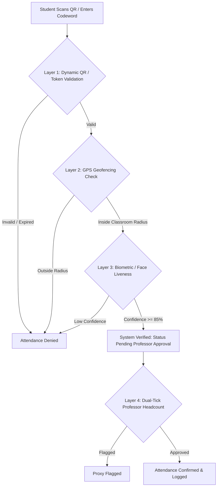

# SecureAttend: Multi-Layer Attendance Verification System

[](#frontend-architecture)
[](#backend-architecture)
[](#database-schema)
[](#deployment)

A production-grade, anti-proxy web application engineered to eliminate attendance fraud in academic and institutional settings using a multi-factor verification pipeline (Dynamic QR, Geofencing, Biometric Liveness, and Dual-Check Professor Headcount).

---

## 🏗️ Architecture & Tech Stack

### High-Level Stack
- **Backend**: **Node.js (v18+) & Express.js**
  - Modular layered architecture: `routes/`, `services/`, `models/`, `middleware/`, `utils/`
  - MongoDB Object-Document Mapping via **Mongoose**
  - Security: `bcryptjs`, CORS origin whitelisting, centralized error handling
  - Anti-proxy utilities: Dynamic QR generation (`qrcode`), UUID tokenization, Haversine geo-distance validation
- **Frontend**: **React 18 & TypeScript**
  - Build Tool: **Vite 5** (lightning fast HMR & optimized production bundling)
  - Styling: **Tailwind CSS v4** + **Material UI v5**
  - Routing: **React Router DOM v6** (Role-Based Route Guards)
  - Icons: **Lucide React** + **MUI Icons**
  - Camera & Scanner: `react-qr-scanner`, `qrcode.react`
- **Database**: **MongoDB** (Atlas / Local)
- **Deployment**: **Render** 

```
SecureAttend/
├── backend/            # Express.js REST API
│   ├── package.json
│   ├── .env.example
│   └── src/
│       ├── config/     # Environment configurations & defaults
│       ├── middleware/ # Auth & error handling middleware
│       ├── models/     # Mongoose Schemas (User, Class, Session, Attendance)
│       ├── routes/     # Express routers (auth, professor, student, ta)
│       ├── services/   # Business logic & background tasks (auto-expire)
│       ├── utils/      # API response wrappers & geo distance math
│       └── server.js   # Server entry point
├── frontend/           # React 18 + Vite + TypeScript Client
│   ├── src/
│   │   ├── components/ # Dashboards (Professor, Student, TA) & UI elements
│   │   ├── config/     # API Axios client & environment config
│   │   ├── services/   # Typed API service abstractions
│   │   └── App.tsx     # Role-based route definitions
└── README.md
```

---

## 🛡️ Multi-Layer Security Pipeline

Traditional attendance systems suffer from proxy marking (students sending screenshots of static QR codes or checking in from dorms). SecureAttend solves this through **4 progressive verification layers**:



1. **Layer 1: Dynamic QR & Rotating Codewords**
   - Sessions generate cryptographic QR tokens and time-decaying codewords.
   - Background service periodically auto-expires sessions.
2. **Layer 2: GPS Geolocation & Radius Verification**
   - High-precision distance calculation using the Haversine formula against the classroom coordinates.
   - Rejects submissions outside configurable perimeter threshold (`GEO_DEFAULT_RADIUS_METERS`, default 50m).
3. **Layer 3: Biometric / Face Verification**
   - Captured camera snapshots undergo facial confidence and liveness threshold validation (`FACE_MIN_CONFIDENCE >= 85%`).
4. **Layer 4: Dual-Tick Professor Headcount & Proxy Flagging**
   - Real-time headcount disparity detection (registered scans vs. physical students present).
   - Professors can inspect individual verification logs and immediately flag suspected proxies.

---

## 🚀 Quick Start Guide

### Prerequisites
- **Node.js**: v18.x or higher
- **npm**: v9.x or higher
- **MongoDB**: Local instance running on `mongodb://localhost:27017` or a MongoDB Atlas cluster URI

---

### 1. Backend Setup

```bash
# Navigate to backend directory
cd backend

# Create environment configuration
cp .env.example .env

# Configure your MONGODB_URI inside .env:
# MONGODB_URI=mongodb+srv://<username>:<password>@cluster.mongodb.net/secureattend?retryWrites=true&w=majority

# Install dependencies
npm install

# Run backend development server (with hot-reload via node --watch)
npm run dev

# API will start on http://localhost:8080/api
```

---

### 2. Frontend Setup

```bash
# In a new terminal window, navigate to frontend
cd frontend

# Install dependencies
npm install

# Start Vite dev server
npm run dev

# Frontend will launch at http://localhost:5173
```

---

## 📋 API Reference

### Authentication (`/api/auth`)
| Method | Endpoint | Description |
| :--- | :--- | :--- |
| `POST` | `/api/auth/register` | Register a new user (`PROFESSOR`, `STUDENT`, or `TA`) |
| `POST` | `/api/auth/login` | Authenticate user credentials & return profile with session token |

### Professor Endpoints (`/api/professor`)
| Method | Endpoint | Description |
| :--- | :--- | :--- |
| `GET` | `/api/professor/classes` | Fetch all courses managed by the professor |
| `POST` | `/api/professor/classes` | Create a new course |
| `POST` | `/api/professor/classes/:classId/sessions` | Generate a new attendance session with QR token & codeword |
| `PUT` | `/api/professor/sessions/:sessionId/close` | Terminate an active session immediately |
| `GET` | `/api/professor/sessions/:sessionId/attendance` | Real-time live attendance stream for an active session |
| `PUT` | `/api/professor/sessions/:sessionId/headcount` | Submit manual classroom headcount |
| `PUT` | `/api/professor/attendance/:attendanceId/flag` | Flag suspected proxy attendance |
| `PUT` | `/api/professor/attendance/:attendanceId/verify` | Dual-tick manual confirmation of student attendance |

### Student Endpoints (`/api/student`)
| Method | Endpoint | Description |
| :--- | :--- | :--- |
| `POST` | `/api/student/mark-attendance` | Submit verification payload (QR token, GPS coords, face capture) |
| `GET` | `/api/student/:studentId/attendance` | Retrieve student's complete historical attendance log |
| `GET` | `/api/student/:studentId/sessions/:sessionId/attendance` | Check status of attendance for a specific session |

### TA Endpoints (`/api/ta`)
| Method | Endpoint | Description |
| :--- | :--- | :--- |
| `GET` | `/api/ta/sessions/:sessionId/attendance` | View verified attendance reports for a lecture |
| `GET` | `/api/ta/students/:studentId/attendance` | Access individual student audit logs |
| `GET` | `/api/ta/analytics` | Fetch attendance percentage trends and flagged proxy statistics |

---

## 💾 Database Schema (MongoDB / Mongoose)

### Collections:
- **`users`**: User identity, hashed passwords, role (`PROFESSOR`, `STUDENT`, `TA`), student registration number.
- **`classes`**: Course code, title, assigned professor ID, enrolled student roster, assigned TAs.
- **`sessions`**: Active lecture session, parent class ID, dynamic `qrToken`, 6-character `codeword`, start/end timestamps, open status, professor headcount.
- **`attendance`**: Record linking student + session, array of `verificationLayersPassed` (`['QR', 'LOCATION', 'FACE']`), `systemVerified`, `professorVerified`, `flaggedProxy`, device timestamp.

---

## 🎯 Interview Talking Points

- **Why Node.js / Express for this system?**
  - Attendance systems experience massive bursts of concurrent requests within a 3-5 minute lecture window. Node.js's non-blocking, event-driven I/O loop handles thousands of concurrent verification requests with low memory overhead compared to thread-per-request architectures.
- **Handling Real-Time Proxy Prevention:**
  - Dynamic QR codes prevent static screenshots from being forwarded in group chats.
  - Haversine mathematical geofencing enforces physical proximity within the lecture hall.
  - Dual-tick verification provides human-in-the-loop validation: if 40 students marked attendance but the professor's headcount is 32, the system flags the anomaly.
- **Modular Code Organization:**
  - Clean separation of concerns between HTTP routing (`routes/`), domain logic (`services/`), data modeling (`models/`), and cross-cutting concerns (`middleware/errorHandler.js`).
